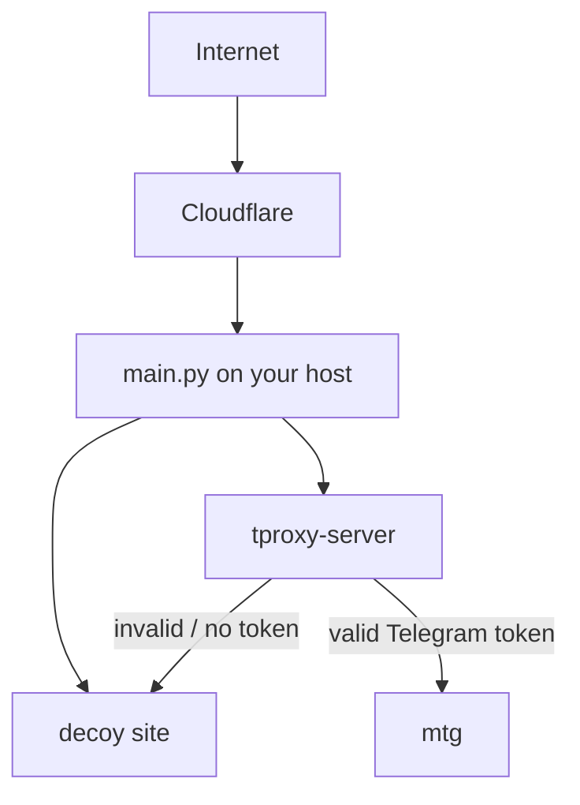

# Setting Up a Telegram WEB Proxy with tproxy-server and Katabump

## What is this?

Since version <Badge type="tip" text="7.1" />, Telegram Desktop has a new proxy type called **WEB**. It disguises your traffic as an ordinary website visit, which makes it much harder to detect and block.

This guide shows how to set up this proxy type completely **for free** on a free host like <Badge type="danger" text="Katabump" />.

## Sites you'll need

Before starting, you'll need accounts on the following sites:

**1. Katabump**
Link: [control.katabump.com][1]
A free host that offers a Python/Node.js plan. This is where the project actually runs.

**2. Orihost** *(alternative to Katabump, optional)*
Link: [orihost.com][9]
A free host similar to Katabump, with the same kind of plan. Use this if Katabump isn't available to you.

**3. Cloudflare**
Link: [dash.cloudflare.com][2]
Used to create the tunnel and get around your host's port restrictions.

**4. Termux**
Link: [termux.dev][3]
A terminal app for Android. You'll use it to build the required binaries on your phone.

**5. A domain registrar** *(if you want to buy your own domain)*
Link: [namecheap.com][10]
For buying a cheap, unused domain -- see [Filtering notes](#filtering-and-domain-notes) for why this matters.

**6. DigitalPlat FreeDomain** *(a free alternative to buying a domain)*
Link: [dash.domain.digitalplat.org][8]
A free subdomain registration service, for when buying a domain isn't an option yet.

**7. tproxy-server repository**
Link: [github.com/telegramdesktop/tproxy-server][6]
Telegram's own official implementation of this proxy type.

**8. mtg repository**
Link: [github.com/9seconds/mtg][7]
The software that actually understands and relays real Telegram traffic.

## Prerequisites

- A Katabump account (or similar) with a Python/Node.js plan
- A free Cloudflare account (only required for a custom domain, not for Quick Tunnel)
- Termux on an Android phone
- A domain (buying one is recommended -- see [Filtering notes](#filtering-and-domain-notes))

## Overall architecture



Every request that reaches your domain first hits `tproxy-server`. If it doesn't carry a valid Telegram token, it's silently shown the decoy site. If it does, it's handed off to `mtg`, which understands real Telegram traffic.

## Recommended method: run the script

::: tip Our recommendation
Instead of doing every step by hand (installing packages, compiling `tproxy-server` and `mtg`, writing the config files), there's a ready-made script that does all of this for you. For most users this is the simplest and fastest route.
:::

Just run this one command in Termux:

```bash
curl -fsSL -o build-web-proxy.sh https://raw.githubusercontent.com/mehdi-hexing/mehdi-hexing/refs/heads/main/docs/public/web-proxy-setup/build-web-proxy.sh && bash build-web-proxy.sh
```

This script:

- Installs the required packages (only if they aren't already installed)
- Compiles `tproxy-server` and `mtg v1`
- Asks you for the domain, tunnel mode, secret and `MTG_PUBLIC_IPV4`, and writes them straight into `config.json`, `profiles.json` and `cf-config.yml` itself -- no need to edit those files by hand afterward
- Downloads `main.py` and copies the binaries in alongside everything else
- Prints a table of everything you entered or that was generated for you at the end, so you can double-check it before uploading (the same table is also saved as `SETTINGS-SUMMARY.txt` inside the project folder)
- Leaves a complete, ready-to-upload folder in your phone's Downloads (`Download/web-proxy-project/`) when it's done
- Is safe to re-run — steps that already finished aren't repeated

### Automatic upload via SFTP (optional)

At the end of the run, the script asks:

```
Do you have SFTP/SSH access to Katabump and want to upload now? [y/N]
```

If you answer `y`, it asks you to paste the SFTP address exactly as your panel shows it (e.g. `sftp://user.katabump.fr:2022`). It parses the host and port from that automatically, and if the address already includes a username (as on Orihost), it won't ask for one separately. The password is your panel password, which the upload command itself will prompt for when it connects.

**Finding your SFTP details:**

- **Katabump:** open the hamburger menu (☰) at the top-left of the panel and go to **Settings** -- the SFTP address and username are there.

- **Orihost:** scroll to the **Files** section near the bottom of the page and open **SFTP Connection Details**.

  **📷 Pic 1/2 :**

<p align="center">
  
</p><br><br/>

**📷 Pic 2/2 :**

<p align="center">
  
</p><br><br/>

If you answer `n` (or just press Enter), this step is skipped and you just get the ready folder in Downloads to upload by hand through the panel's web File Manager.

## Manual method (only if you want to do it yourself)

::: details Open this section only if you'd rather go step by step manually
If you already ran the script above, you don't need to read this — skip straight to [Which files do you need to edit yourself](#which-files-do-you-need-to-edit-yourself).

### Step 1: Install Termux prerequisites

```bash
pkg update && pkg upgrade
pkg install golang git openssl-tool cloudflared openssh
```

### Step 2: Build tproxy-server

```bash
git clone https://github.com/telegramdesktop/tproxy-server.git
cd tproxy-server
CGO_ENABLED=0 GOOS=linux GOARCH=amd64 go build -trimpath -buildvcs=false \
    -o ../tproxy-server-linux ./cmd/tproxy-server
```

### Step 3: Build mtg

```bash
git clone https://github.com/9seconds/mtg.git mtg-v1
cd mtg-v1
git checkout v1.0.12
CGO_ENABLED=0 GOOS=linux GOARCH=amd64 go build -trimpath -buildvcs=false \
    -o ../mtg-v1-linux .
```

### Step 4: Generate a secret

```bash
openssl rand -hex 16
```

The output is a 32-character string. You'll put this in `profiles.json` in the next step, and use the same value in the final Telegram link.

### Step 5: Set up the config files

#### config.json

```json
{
  "public_hostname": "your-domain.example.com", // [!code focus]
  "base_path": "",
  "listen": "127.0.0.1:8080",
  "admin_listen": "127.0.0.1:8081",
  "public_upstream": "http://127.0.0.1:3000",
  "token_key_file": "./token.key",
  "static_routes": "exact",
  "profiles_file": "./profiles.json",
  "enable_pprof": false,
  "limits": {
    "max_sessions_global": 128,
    "max_streams_global": 4096
  },
  "timeouts": {
    "backend_dial": "5s",
    "long_poll": "25s",
    "reconnect_grace": "2m",
    "idle": "75s"
  }
}
```

Only change the `public_hostname` line to your own domain; leave the rest as is.

#### profiles.json

```json
{
  "profiles": [
    {
      "name": "primary",
      "secret": "REPLACE_WITH_YOUR_OWN_32_HEX_SECRET", // [!code focus]
      "backend": "127.0.0.1:2398",
      "carrier_mode": "https"
    }
  ]
}
```

Only change the `secret` line to the value you generated in Step 4.

#### cf-config.yml (only if you have your own domain)

```json
tunnel: tproxy
credentials-file: ./YOUR-TUNNEL-UUID.json // [!code focus]

ingress:
  - hostname: your-domain.example.com // [!code focus]
    service: http://localhost:8080
    originRequest:
      httpHostHeader: your-domain.example.com // [!code focus]
  - service: http_status:404
```

If you're using Quick Tunnel mode (next step), you don't need this file at all.

#### A simple decoy site

You'll also need a plain `index.html` -- any ordinary page works, it just needs to look like a real website.

### Step 6: Pick a tunnel mode

There are two ways to connect your server to the internet:

::: tip Quick Tunnel (simplest, no domain needed)
No sign-up required. Great for quick testing, but the link changes every time you restart the server.
:::

::: info Named Tunnel (stable, needs your own domain)
A fixed address on your own domain -- the link always stays the same.
:::
:::

## Which files do you need to edit yourself?

::: tip If you used the script
The script already asked you for these and wrote them straight into the files -- this table is mainly for the manual method, or for double-checking everything landed correctly (which is also what the script's own summary table at the end does).
:::

| File | What to change |
|---|---|
| `profiles.json` | the `secret` field |
| `config.json` | the `public_hostname` field |
| `cf-config.yml` *(Named Tunnel only)* | `hostname`, `credentials-file`, `httpHostHeader` |
| `my-site/index.html` | the page content (any simple HTML) |
| `MTG_PUBLIC_IPV4` env var | the `IP:PORT` your panel assigned you |
| `QUICK_TUNNEL` env var | `1` for Quick Tunnel mode, empty for Named Tunnel |

Files you should never create or edit by hand: `token.key` and `status.html` -- the script generates these itself.

## Run it on Katabump

The following files need to be in your project's root folder:

```
main.py
config.json
profiles.json
cf-config.yml
tproxy-server-linux
mtg-v1-linux
cloudflared
my-site/index.html
```

::: warning Set PY FILE in the Katabump panel
In the Katabump panel, go to the **Startup** section, find the **PY FILE** field, and change it to `main.py` -- otherwise the panel won't know which file to run.
:::

To run with Quick Tunnel You Should to Change Python Code **QUICK_TUNNEL** Value From 0 to --> ("QUICK_TUNNEL", "1") :

```json
# auto-detects it and rewrites config.json + status.html each time.
QUICK_TUNNEL = os.environ.get("QUICK_TUNNEL", "0") == "1" // [!code focus]
QUICK_TUNNEL_URL_RE = re.compile(r"https://([a-zA-Z0-9.-]+\.trycloudflare\.com)")
```

To run with a Named Tunnel:

```bash
python /home/container/main.py
```

## Filtering and domain notes

Some carriers block well-known free subdomain services (like `dpdns.org`, `ggff.net`, `filegear-sg.me`) at the DNS level, regardless of what's actually running behind them. Based on that experience, here's the recommended order of options:

### 1. Buy your own domain (best option)

The most reliable path. A domain with no history (even a cheap TLD like `.xyz` or `.online`) has a much better chance of getting through filtering.

### 2. Cloudflare Quick Tunnel

If buying a domain isn't an option right now, `trycloudflare.com` (Cloudflare's own domain) is the next best choice. The only downside is that the link changes every time you restart the server.

### 3. DigitalPlat FreeDomain

You can register a free subdomain (`.us.kg`, `.qzz.io`, `.qd.je`, `.xx.kg`) at [dash.domain.digitalplat.org][8].

::: warning Use caution
`dpdns.org` -- which got blocked in our tests -- belongs to this same provider. Test it on your actual network before relying on it.
:::

## Common troubleshooting

| Error | Fix |
|---|---|
| `unknown field "_comment"` | Only keep documented fields in your JSON files |
| `profiles.json` permission errors | The script fixes this automatically |
| `token_key_file: no such file` | The script generates this once, automatically |
| `incorrect first byte of secret` | Make sure you're using mtg **v1**, not v2 |
| `cannot resolve any public address` | Set the `MTG_PUBLIC_IPV4` variable |
| Client stuck on "Connecting..." | Make sure `public_hostname` exactly matches your real domain |

## Tips About services

::: danger Don't Forget
<br/>
For Katabump : You must log in to the Katabump panel and Renew your server every 4 days; otherwise, the server and proxy will stop working.

<br/>
For Orihost : You must log in to the Orihost panel and Renew your server every 7 days; otherwise, the server and proxy will stop working.

<br/>

The free plan has limited resources (308 MB RAM, 25% of one CPU core); this is sufficient for personal use or a small group of users.
:::

## Support and Help

::: info Further Assistance
If you encounter any questions or issues during setup or while using this project, you can reach out through the following channels:  
- Direct contact: [My personal Telegram account][4]
- General Q&A: [Telegram support group][5]   
:::

## Additional details (for the curious)

::: details Why is CGO_ENABLED=0 needed?
When compiling with Go on Termux, if CGO is enabled, the compiler tries to build parts of the code with a C toolchain matching your phone's own architecture (ARM), while your server needs an amd64 build. This causes strange compile errors. `CGO_ENABLED=0` skips that step entirely and gives you a clean cross-compile.
:::

::: details Why does it have to be mtg v1, specifically?
Version 2 only accepts FakeTLS secrets (the ones starting with `ee`), while `tproxy-server` only accepts classic or `dd`-prefixed secrets. The two aren't compatible, so you need version 1, which supports the classic format.
:::

::: details Why was httpHostHeader needed in cf-config.yml?
`tproxy-server` decides whether a request is real Telegram traffic or just an ordinary visitor based on the Host header. You need to make sure Cloudflare always forwards your actual domain as the Host header, not something else.
:::

::: details Why does mtg need a public IP?
mtg needs to know its own publicly reachable address to talk to Telegram's own middle proxies. On free hosts like Katabump, which sit behind an internal network layer, it can't guess this on its own -- so it has to be given explicitly via `MTG_PUBLIC_IPV4`.
:::

[1]: https://control.katabump.com
[2]: https://dash.cloudflare.com
[3]: https://termux.dev
[4]: https://t.me/mehdiasmart
[5]: https://t.me/NiREvil_GP
[6]: https://github.com/telegramdesktop/tproxy-server
[7]: https://github.com/9seconds/mtg
[8]: https://dash.domain.digitalplat.org
[9]: https://orihost.com
[10]: https://www.namecheap.com
